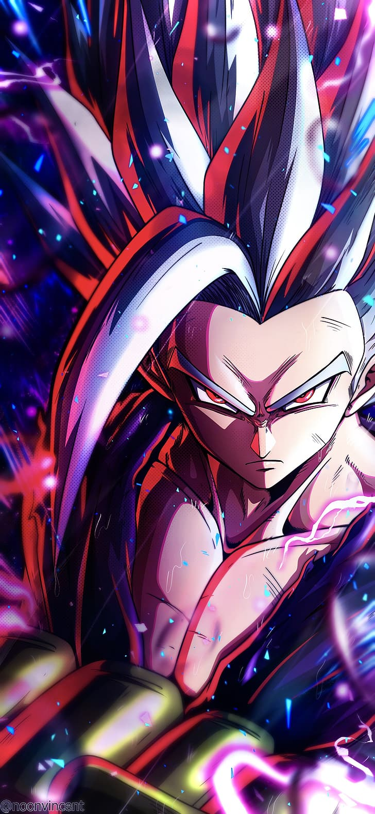

 </h1>
<a href="https://git.io/typing-svg"></a>
 </a>
<br/>




```
I'm Zaman
-------------------------
- I am a self taught Independent Security Reasercher and a Network Engineer
- I have a strong interest in Cyber Security and Penetration Testing
- Working on Server Support Maintanace 
- Learning about Computer Vision and Security Operations stuff
- Main languages: Python and Bash only
```


<div align="center" width="100%">
      
</div>

